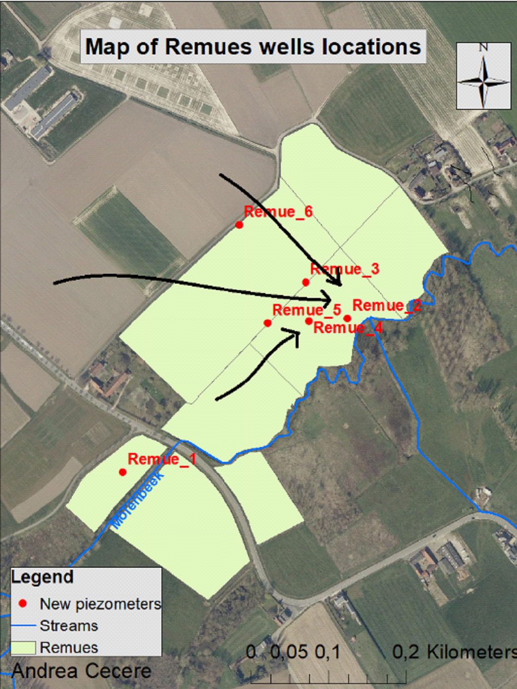

# Context
Six piezometers are placed on the Remue fields (Neerstraat w/ Landskoutersesteenweg, Merelbeke). 
Wells are build from PVC tubes with an outer diameter of 4.6cm. For the filters, small incisions are cut with a saw 
along 50cm from the bottom of the pipe and with approximately 2 cm between each cut.  Once the borehole was made, 
the depth was measured, the tube is solidly closed at the bottom and inserted. To backfill the borehole, sand is used 
until one meter below the surface to avoid filter obstruction. Then, the remaining meter is filled with bentonite 
pellets, an expandable clay material, to seal the gap and prevent preferential infiltration along the well.

The tubes are cleaned by injecting water from a water tank connected to a high pressure cleaner installed on a tractor 
and connected to a generator. Caps are finally placed to close the well top. TD-divers 10m and 20m are placed inside 
each well, recording every 5 minutes the pres-sure (cmH20) above the captor. A baro-diver is used to measure the air 
pressure in the area. Diver-Office 2021 is a data logger programm used to schedule divers and collect data from the probes. 

The pressure must be corrected with the air pressure to get the water pressure. For each well, the water level is 
measured manually for a specific time step, to convert later the depth into hydraulic head (mTAW). This step is 
essential to have an equivalence between hydraulic head in mTAW and water pressure given by the probe.

## Details piezometer installation
### Piezo 1 (Remue_1)
Installation
- Depth: 305 cm
- Height: 113 cm
- Length: 418 cm
- Filter length: 50 cm
- Depth sand: 180-255
- Depth bentonite: 0 - 180
- Sensor code : AP689 

### Piezo 2 (Remue_2)
Installation
- Depth : 250 cm
- Height: 120 cm
- Length: 370 cm
- Filter length : 50 cm
- Depth sand: 90 - 250 cm
- Depth bentonite: 0 - 90 cm
- Weak profile development. Close to stream.
- Sensor code: DI802 20m AG083 

###  Piezo 3 (Remue_3)
Installation
- Depth: 315 cm
- Height: 100 cm
- Length: 415 cm
- Filter length: 50 cm
- Depth sand: 150 - 315 cm
- Depth bentonite: 0 - 150 cm
- Sensor code: DI801 10m AZ649 

###  Piezo 4. (Remue_4)
Installation
- Depth: 235cm
- Height: 115cm
- Length: 350 cm
- Filter length: 50cm
- Depth sand: 100 - 235
- Depth bentonite: 0 - 100
- Sensor code:  DI801 10m CA186 

### Piezo 5 (Remue_5)
Installation
- Depth: 345 cm
- Height: 106 cm
- Length: 451 cm
- Filter length : 50 cm
- Depth sand: 150 - 345 cm
- Depth bentonite: 0 - 150 cm
- Sensor code: DI801 10m CA969

### Piezo 6 (Remue_6)
Installation
- Depth: 290 cm
- Height: 100 cm
- Length : 390 cm
- Filter length: 50cm
- Depth sand : 80 - 290 cm
- Depth bentonite: 0 - 80 cm
- sensor code:
  - Diver : DI802 20m AP707
  - Baro-diver : AP825 -> this logs air pressure in the well, NOT in the groundwater